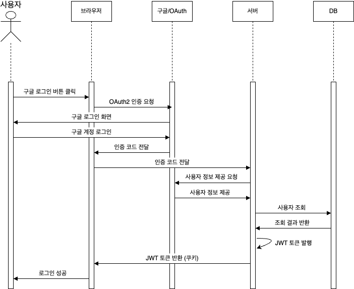
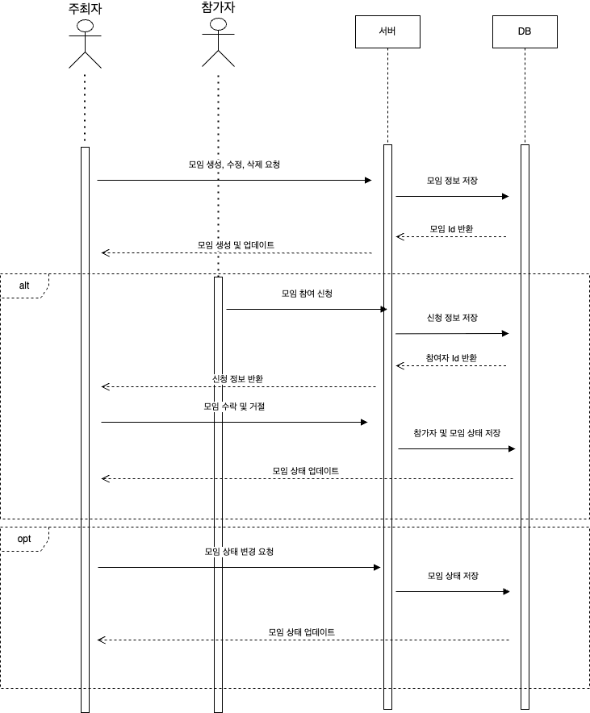
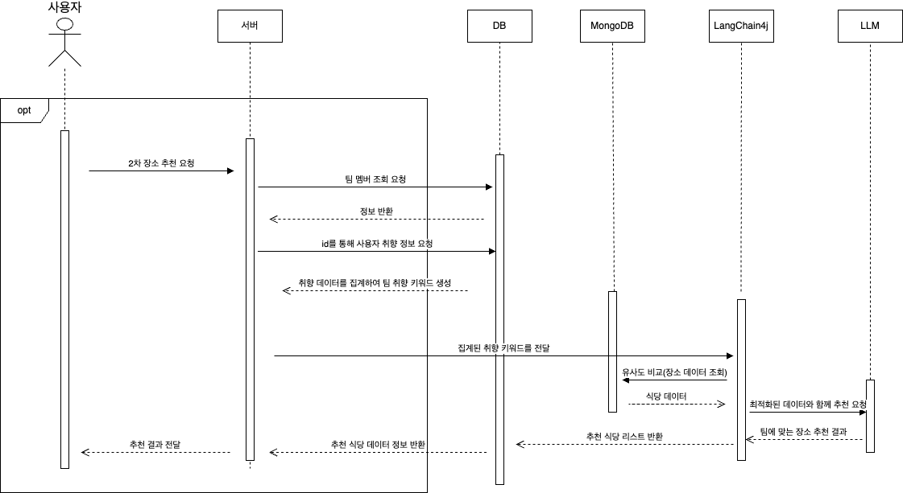
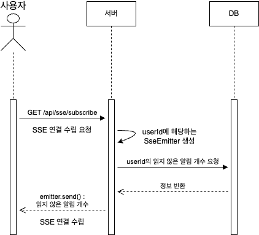
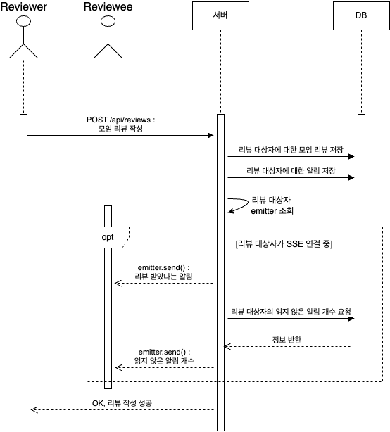

# NBE5-6-3-Team06
## 맛남
프로그래머스 백엔드 데브코스 5기 6회차 3차 프로젝트 6팀(API-Tizer)

---
## 팀원 소개
|  |  |  |  |  |
|:------------------------------------------------------------------------------------------------------------------------------------------------------:|:-----------------------------------------------------------------------------------------------------------------------------:|:-----------------------------------------------------------------------------------------------------------------------------:|:------------------------------------------------------------------------------------------------------------------------------------------------------:|:----------------------------------------------------------------------------------------------------------------------------:|
|                                                                          손혜은                                                                           |                                                              김윤서                                                              |                                                              박병석                                                              |                                                                          이서준                                                                           |                                                             전정원                                                              |
|                                                                           팀장                                                                           |                                                              팀원                                                               |                                                              팀원                                                               |                                                                           팀원                                                                           |                                                              팀원                                                              |
|                                                         [@hesador12](https://github.com/hesador12)                                                         |                                         [@yunseoy](https://github.com/yunseoy)                                          |                                            [@Parkbyungseok](https://github.com/Parkbyungseok)                                             |                                                     [@leesojun34](https://github.com/leeseojun34)                                                      |                                           [@JeonJW24](https://github.com/JeonJW24)                                           |
---

## 1. 프로젝트 개요
### 맛집 메이트 - 맛남
맛집을 중심으로 사람들을 연결해주는 모임 플랫폼

## 2. 주요 기능
- 사용자 관리
- 모임 관리
- 맛집 관리
- 매너온도 평가
- 2차 추천
- 관리자
- 채팅
- 알림

## 3. 작업 및 역할 분담
| 이름  | 역할                                                                                                             |
|:---:|:---------------------------------------------------------------------------------------------------------------|
| 손혜은 | <ul><li>팀 리딩</li><li>사용자 맛집 관리</li><li>맛집 지도 등록/수정/삭제/조회</li><li>맛집 지도 공유</li></ul>                            |
| 김윤서 | <ul><li>모임 생성/수정/삭제/조회</li><li>모임 참여 신청</li><li>모임 상태 관리</li></ul>                                             |
| 박병석 | <ul><li>2차 추천(LLM)</li><li>모임 참가자 취향 집계 및 분석</li><li>모임별 채팅 송수신/조회</li></ul>                                   |
| 이서준 | <ul><li>소셜 로그인</li><li>사용자 관리(회원)</li><li>매너온도 평가</li><li>게시물/채팅 신고</li><li>음식 랭킹 관리</li><li>시큐리티 설정</li></ul> |
| 전정원 | <ul><li>사용자 관리(관리자)</li><li>모임 관리</li><li>신고 관리</li><li>식당 관리</li><li>통계</li><li>사용자/관리자 알림</li></ul>          |

## 4. 주요 기능 시퀀스 다이어그램
### 1. 구글 로그인

### 2. 모임

### 3. 추천

### 4. SSE 연결 요청

### 5. SSE 알림 예시 - 리뷰

## 5. API 명세서
[맛남 API 명세서](docs/api/api)

## 6. 기술 스택

 
  
  
  
  
   

  
  
  
  
   

